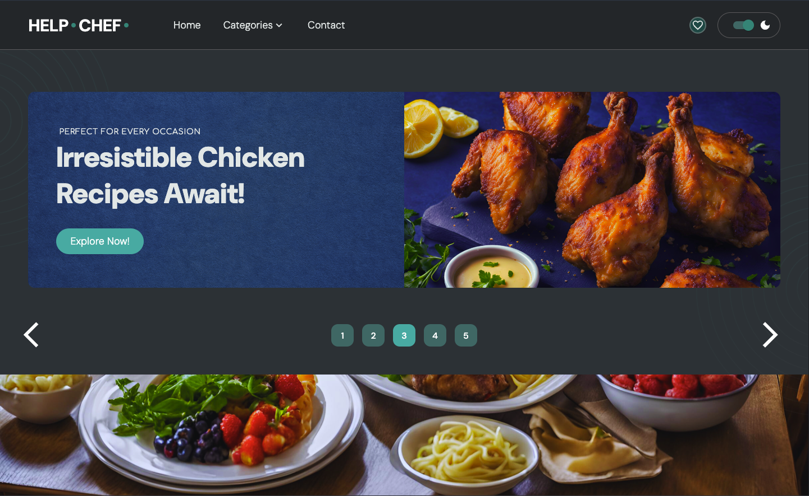
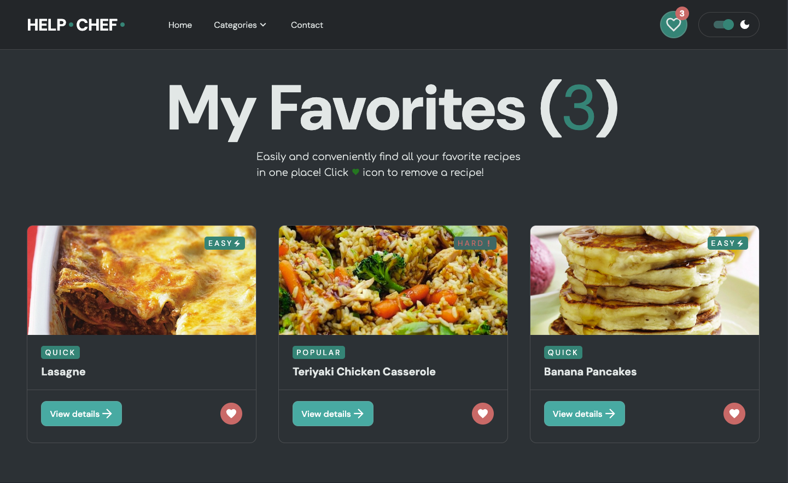
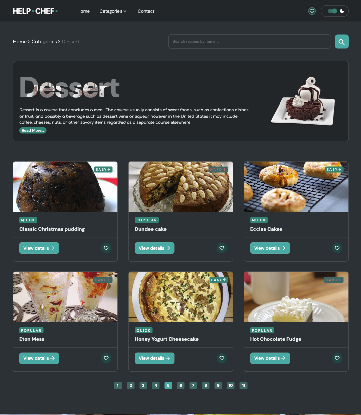
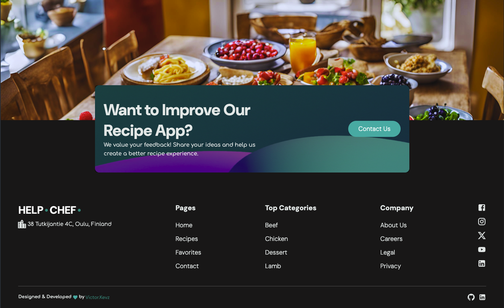

# Help-Chef Recipe App

## Description

Help-Chef is a web application designed to help users find recipes based on their ingredients, dietary preferences, and favorite dishes. Whether you’re a home cook or a professional chef, Help-Chef brings a variety of recipes and useful tools to assist with meal planning and preparation.

This app integrates the MealDB and Spoonacular APIs to display recipes, search through different categories, and offer a smart recipe search by ingredients. It also features user interaction tools like a “favorites” system, dynamic categories, and real-time updates.

**Live Site**: [https://victorkevz.github.io/Help-Chef-App/](https://victorkevz.github.io/Help-Chef-App/)

**Repository**: [https://github.com/VictorKevz/Help-Chef-App.git](https://github.com/VictorKevz/Help-Chef-App.git)


## Features

- **Search Filters**: Filter recipes by category, difficulty, and popularity.
- **Favorites System**: Save your favorite recipes for easy access.
- **Meal Details**: View detailed information about each recipe, including ingredients, instructions, and nutritional facts.
- **Dark/Light Mode**: Toggle between dark and light themes for improved readability.
- **Responsive Layout**: Optimized for both desktop and mobile devices.

## Tech Used

- **HTML** for the structure
- **CSS** for styling
- **ReactJS** for building the user interface
- **Framer Motion** for smooth animations
- **Vite** for fast development build tool
- **Material UI** for UI components
- **MealDB API** and **Spoonacular API** for fetching recipe data

## Installation

To run this project locally:

Clone the repository:
```git clone https://github.com/VictorKevz/Help-Chef-App.git

Navigate to the project directory:
`cd tech-ride-eCommerce-site`

Install dependencies:
`npm install`

Start the development server:
`npm run dev`

Open the app in your browser at http://localhost:5173. 

## Usage

 1.	Search Recipes: Enter ingredients or a meal name in the search bar   to find recipes.
 2.	Explore Categories: Click on different categories to view related recipes.
 3.	Save Favorites: Click the heart icon on any recipe to add it to your favorites.
 4.	Recipe Details: Click on any recipe to view detailed instructions, ingredients, and more.
 5.	Toggle Themes: Switch between dark and light mode using the theme toggle.